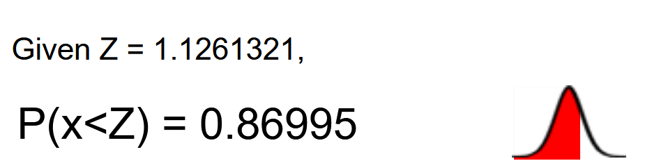

```{r setup, include=FALSE}
knitr::opts_chunk$set(
	echo = TRUE,
	message = TRUE,
	warning = TRUE
)

library(tidyverse)
library(magrittr)
library(tidymodels)

rm(list = ls())
```

#1. Data: Party Brands 
Today we are using data from Noam Lupu's work on [\textcolor{red}{ Party Brands and Partisanship}](https://onlinelibrary.wiley.com/doi/abs/10.1111/j.1540-5907.2012.00615.x) in Argentina. We use it to familiarize ourselves with survey experiments by replicating some of his results.  

What we need to know about the paper: 

* Two main theories on the dynamics of partisanship:
   * Partisanship as a social identity (stable)
   * Partisanship as a rational maximisation expected utility (unstable)

What is Lupu trying to empirically test on this paper?  

- That partisanship as a social identify does not imply necessarily partisan stability 
- Test his theory that incorporates comparative fit, which means that people think their group differs from other groups 
- Testable implication: When parties converge, their brands are diluted, thus, it become more difficult for voters to distinguish parties from one another and subsequently party attachments are weaken. 

---

# Details of the experiment

* A survey experiment
* Manipulation of information about political parties that suggest either *diverge* or *converge* among the parties
* Between-subject design with three-treatment arms, plus a control
* Information was gleaned from party manifestos and official statements
* Control: Party symbols with name of the party leaders 

* Outcomes of interest: 
-*Partisanship* as the proportion of respondents said they identified with a political party 
-*Partisan attachment*  on a 0 - 10 scale 
We load the data, in .csv format, as follows: 

You can use the following shortcuts to insert a r chunk: Ctrl + Alt + I or Cmd + Option + I


```{r, eval=TRUE}
brands=read.csv("http://www.spyroskosmidis.net/wp-content/uploads/2018/01/lupubrands.csv")

# tidy version:
brands_tidy <- as_tibble(brands)
```

What variables does the data include? 

```{r, eval=TRUE}
head(brands) #Checking first 6 rows of the data 

# tidy version:
glimpse(brands_tidy)

brands_tidy %>%
  head() %>%
  knitr::kable()
```
---

Among these variables, let's focus on the treatment variables and the outcome. There are four variables associated with the treatments and they are captured by the categorical variable```formulario```

* 1 = Control group
* 2 = Platform Information 
* 3 = Alliance Switching
* 4 = Full Text
 
This variable is recoded into the dummies ```frm2=1``` which takes the value 1 if the respondent received the platform information treatment, ```frm3=1``` for alliance switching and ```frm4=1``` for the full text. Note the omitted dummy represents the control group.  

For now, however, let's use the original, categorical variable. As it is conventional, we aim to have the control group assigned to value 0. 

```{r}

brands$treat=brands$formulario-1  #Assigning value 0 to the control group

# tidy version: 
brands_tidy <- brands_tidy %>%
  mutate(treat = formulario - 1) 

```


Did we define the treatment variable correctly? Let's check again:  

```{r}

head(cbind(brands$formulario, brands$treat, brands$frm2,brands$frm3,brands$frm4))

assignment <- brands_tidy %>%
  select(formulario, treat, frm2, frm3, frm4)

head(assignment)

```

Everything looks good! Taking the first row as example, when ```formulario==3``` (column1), the treatment variable we generated takes the value 2 (formulario-1) and the dummy for value 3 (frm3) take the value 1, whereas the others are 0. 

---

The Model: OLS Estimations

Lupu is interested in the effect of the three treatment conditions on partisanship. Among the two outcomes,  ```pid``` (whether the individual identifies with a party) and ```pidstr``` (a 10 point scale representing the strength of the respondent's party identification), we will focus below mainly on the latter.

#3.Let's beging with a simple OLS model with no covariates:

```{r}
summary(lm(pidstr~treat, data=brands))

# tidy version: 
lin_fit <- linear_reg() %>%
  set_engine("lm") %>%
  fit(pidstr ~ treat, data = brands_tidy)

tidy(lin_fit)

```

Does this regression make sense? Hint: ```class(brands$treat)```.

```{r}
#Let's assign labels to each group. This will help with the output!

brands$treat[brands$treat==0]="Control"
brands$treat[brands$treat==1]="Platform"
brands$treat[brands$treat==2]="Switch"
brands$treat[brands$treat==3]="Full"


# tidy version:
brands_tidy <- brands_tidy %>%
  mutate(treat = recode(
    treat,
    `0` = "Control",
    `1` = "Platform",
    `2` = "Switch",
    `3` = "Full"
  ))
```

---

Re-running the regression from above and telling R to model treat as a factor variable:


```{r}
summary(lm(pidstr~factor(treat), data=brands))

# tidy version: 
lin_fit <- linear_reg() %>%
  set_engine("lm") %>%
  fit(pidstr ~ factor(treat), data = brands_tidy)

tidy(lin_fit)
```

The OLS regression results look like mere mean differences. Let's see if that is true:

```{r}
pid.control=mean(brands$pidstr[brands$treat=="Control"], na.rm=T)
pid.platform=mean(brands$pidstr[brands$treat=="Platform"],na.rm=T)
pid.switch=mean(brands$pidstr[brands$treat=="Switch"],na.rm=T)
pid.full=mean(brands$pidstr[brands$treat=="Full"],na.rm=T)

ate.platform=pid.platform-pid.control
ate.switch= pid.switch-pid.control
ate.full=pid.full-pid.control
```


```{r}
# tidy version:

pid.control <- brands_tidy %>% # E_Y_X_control
  filter(treat == "Control") %>%
  summarise(conditional_mean = mean(pidstr, na.rm = TRUE))

pid.platform <- brands_tidy %>% # E_Y_X_platform
  filter(treat == "Platform") %>%
  summarise(conditional_mean = mean(pidstr, na.rm = TRUE))

pid.switch <- brands_tidy %>% # E_Y_X_switch
  filter(treat == "Switch") %>%
  summarise(conditional_mean = mean(pidstr, na.rm = TRUE))

pid.switch <- brands_tidy %>% # E_Y_X_1_full
  filter(treat == "Full") %>%
  summarise(conditional_mean = mean(pidstr, na.rm = TRUE)) 

ate.platform=pid.platform-pid.control
ate.switch= pid.switch-pid.control
ate.full=pid.full-pid.control

ate.platform
ate.switch
ate.full
```
---

The ATEs we calculated just now are identical to the OLS slopes we calculated before. So, why do OLS? 

Firstly, we prefer models that can calculate measures of dispersion for the estimates. In other words, through substracting the means by treatment group we would not be able to know whether the ATEs are statistically significant. Secondly, the advantage of using OLS is that we can include -pre-treatment- covariates. 

Still, can you think of other ways to estimate statistical uncertainty without using OLS?

---

Let's see what happens when we add covariates:

```{r}
summary(lm(pidstr~factor(treat)+age+income+educgrp+info, data=brands))

```

Are the results the same? 

```{r}
#Re-estimate the main model
atemod=lm(pidstr~factor(treat), data=brands)
summary(atemod)
nobs(atemod)

#Add covariates
atemodcont=lm(pidstr~factor(treat)+age+income+educgrp+info, data=brands)
summary(atemodcont)
nobs(atemodcont)
#Why do we lose so many observations? Is this is a fair comparison of the ATE?

#Let's constrain the estimation to the N of the model with the added covariates
esample=rownames(as.matrix(resid(atemodcont)))

atemodsample=lm(pidstr~factor(treat), data=brands[esample,])
summary(atemodsample)
nobs(atemodsample)

#install.packages("stargazer")
library(stargazer)

stargazer(atemodcont, atemodsample,  type = "text")

# sort of a tidy version:

constrain <- brands_tidy %>% 
  filter(row.names(brands_tidy) %in% esample) 

atemodsample=lm(pidstr~factor(treat), data=constrain)
summary(atemodsample)
nobs(atemodsample)
```

---

 _Randomization Checks_
 
Let's do some randomization checks. Is the mean value of age similar across treatment groups?

```{r}
t.test(brands$age~brands$frm2, data=brands, subset=c(brands$frm3!=1,brands$frm4!=1))
```

```{r}
#and, similarly, for the other treatments
t.test(brands$age~brands$frm3, data=brands, subset=c(brands$frm2!=1,brands$frm4!=1))
t.test(brands$age~brands$frm4, data=brands, subset=c(brands$frm3!=1,brands$frm2!=1))
```
---

How about income?

```{r}
t.test(brands$income~brands$frm2, data=brands, subset=c(brands$frm3!=1,brands$frm4!=1))
t.test(brands$income~brands$frm3, data=brands, subset=c(brands$frm2!=1,brands$frm4!=1))
t.test(brands$income~brands$frm4, data=brands, subset=c(brands$frm3!=1,brands$frm2!=1))
```
---

Or gender? 

```{r}
table(brands$frm2,brands$female[brands$treat!=3 & brands$treat!=2])
prop.test(table(brands$frm2,brands$female[brands$treat!=3 & brands$treat!=2]))
```

```{r}
prop.test(table(brands$frm3,brands$female[brands$treat!=3 & brands$treat!=1]))
prop.test(table(brands$frm4,brands$female[brands$treat!=3 & brands$treat!=2]))

# tidy version - need to double check: 
library(broom)

brands_tidy %>%
  filter(treat ==  c("Switch", "Control")) %>% 
  group_by(frm4, female) %>%
  summarise(cases = n()) %>%
  mutate(pop = sum(cases)) %>%
  rowwise() %>%
  mutate(tst = list(broom::tidy(prop.test(
    cases, pop, conf.level = 0.95
  )))) %>%
  tidyr::unnest(tst)
```
---

An equivalent to a ttest is the kolomogorov smirnov test that compares distributions (only works for continuous variables)


$$
D = \max_{1 \leq i \leq N} (F(Y_i) - \frac{i - 1}{N}, \frac{i}{N} - F(Y_i))
$$


```{r}
#age
ks.test(brands$age[brands$frm3!=1 & brands$frm2!=1 & brands$frm4==1],
        brands$age[brands$frm3!=1 & brands$frm2!=1 & brands$frm4==0]) # Fullinfo vs Control

ks.test(brands$age[brands$frm3==1 & brands$frm2!=1 & brands$frm4!=1],
        brands$age[brands$frm3==0 & brands$frm2!=1 & brands$frm4!=1]) # Switching vs Control

ks.test(brands$age[brands$frm3!=1 & brands$frm2==1 & brands$frm4!=1],
        brands$age[brands$frm3!=1 & brands$frm2==0 & brands$frm4!=1]) # Platform vs control

#income
ks.test(brands$income[brands$frm3!=1 & brands$frm2!=1 & brands$frm4==1],
        brands$income[brands$frm3!=1 & brands$frm2!=1 & brands$frm4==0]) # Fullinfo vs Control

ks.test(brands$income[brands$frm3==1 & brands$frm2!=1 & brands$frm4!=1],
        brands$income[brands$frm3==0 & brands$frm2!=1 & brands$frm4!=1]) # Switching vs Control

ks.test(brands$income[brands$frm3!=1 & brands$frm2==1 & brands$frm4!=1],
        brands$income[brands$frm3!=1 & brands$frm2==0 & brands$frm4!=1]) # Platform vs control

```

There are alternatives of running these randomization tests. For example, we could redefine all categorical variables into dummies and run ```prop.test()``` for all. A more conservative way of testing this for categorical variables is to run a chi-square test, for example:

```{r}

table(brands[c(brands$frm3!=1,brands$frm4!=1),]$income,brands[c(brands$frm3!=1,brands$frm4!=1),]$frm2)

chisq.test(table(brands[c(brands$frm3!=1,brands$frm4!=1),]$income,brands[c(brands$frm3!=1,brands$frm4!=1),]$frm2))


```

---

Finally, one could also do a multivariate randomization check. This is is easier if the treatment is binary. In our case, we need to use some packages. 

```{r}
#install.packages("nnet")
require(nnet)
```
and run 

```{r}
multi=multinom(treat~age+income+educgrp+info+female, data=brands)

```

```{r}
summary(multi)

```

Now, let's find out the p-values.

```{r}
alpha=summary(multi)$coefficients/summary(multi)$standard.errors
abs(alpha)
p <- (1 - pnorm(abs(alpha), 0, 1)) * 2
p


```




Only income and gender in the *Full* treatment are suspect for imbalance. All other covariates are fine!

---

What if the treatment is binary? Suppose we were only interested in the Platform Vs Control treatment effect. How should you check if randomization worked? 


One options is to use OLS:
```{r}
require(coefplot) #loading package to make the plot
```


```{r}
PlatVControl=brands[c(brands$treat=="Control" | brands$treat=="Platform"),]
randcheck=lm(frm2~age+income+educgrp+info+female,data=PlatVControl)
summary(randcheck)
coefplot(randcheck, intercept=F, col="black" )


# tidy version: 
library(estimatr)

PlatVControl_tidy <- brands_tidy %>% 
  filter(treat %in% c("Control", "Platform"))

randcheck_tidy <- lm_robust(frm2~age+income+educgrp+info+female,data=PlatVControl_tidy) # but using HC2 standard errors (heteroscedasticity-consistent standard errors)

randcheck_tidy %>%
  tidy %>%
  filter(term != "(Intercept)") %>%
  ggplot(aes(y = term, x = estimate)) +
  geom_vline(xintercept = 0, linetype = 2) +
  geom_point() +
  geom_errorbarh(aes(
    xmin = conf.low,
    xmax = conf.high,
    height = 0.1
  )) +
  theme_bw()

```
---

Option 2 (logit): 

```{r}
randchecklogit=glm(frm2~age+income+educgrp+info+female,data=PlatVControl, family=binomial(logit) )
summary(randchecklogit) # (the deviance residual is -2*log likelihood)
coefplot(randcheck, intercept=F, col="black" ) 

# p- value 
with(randchecklogit, pchisq(null.deviance - deviance, df.null - df.residual, lower.tail = FALSE))

logLik(randchecklogit)

# tidyverse version
library(tidymodels)
library(parsnip)

# convert the treatment variable into a factor:
PlatVControl_tidy <- PlatVControl_tidy %>% 
  mutate(frm2 = factor(x = frm2,
                           levels = 0:1,
                           labels = c("Control", "Treatment")))


log_mod <- logistic_reg() %>%
  set_engine("glm")

mult_fit  <- log_mod %>%
  fit(frm2 ~ age + income + educgrp + info + female, data = PlatVControl_tidy)
mult_fit 

tidy(mult_fit)
```

So, with binary treatment variables, one should use OLS or logit. 
